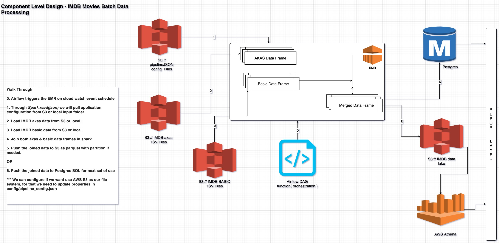

# imdb-movies_pipeline

This repository will be used for managing all the code related to pipeline for IMDB Movies data.

## Component Level Design



## ETL Project Structure

The basic project structure is as follows:

```bash
root/
 |-- configs/
 |   |-- install_python_modules.sh
 |   |-- pipeline_config.json
 |-- dependencies/
 |   |-- Logging.py
 |   |-- Spark.py
 |-- helpers/
 |   |-- S3Helper.py
 |   |-- GenericHelper.py
 |-- controller/
 |   |-- IMDBMoviesETL.py
 |-- airflow-script/
 |   |-- imdb_airflow_dag.py
 |-- input/
     |-- title.akas.tsv
     |-- title.basic.tsv
 |-- service/
     |-- IMDBMoviesService.py
 |-- tests/
 |   |-- test_data/
 |   |-- | -- title.akas.tsv
 |   |-- | -- title.basic.tsv
 |   |-- IMDBMoviesServiceTest.py
 |   build.sh
 |   setup.py
```
# Assumptions

    1. As there's no date time involved in the data set I cannot make this pipeline incremental. 
    This batch pipeline will always be full load with data write mode overwrite.

    2. There should be a postgreSQL instance availble for this pipeline to run

    3. As the input data(title.akas.tsv and title.basics.tsv) file size are huge, 
    for local run I have reduced the file size to 60 MB & 13 MB respectively,
    such that I can commit & share the code.

# Requirements

    python 3.7 or higher
    pyspark 3.1.2
    postgreSQL 10.X
    *AWS S3
    *Airflow
    *AWS EMR


    * If we want to run/schedule the job on AWS EMR Using Apache Airflow.
    
# postgreSQL schema & table Creation

    CREATE DATABASE bonial;
    
    CREATE TABLE public.imdb_movies (
	titleId text NULL,
	"ordering" int4 NULL,
	title text NULL,
	region text NULL,
	"language" text NULL,
	"types" int4 NULL,
	"attributes" text NULL,
	isOriginalTitle int4 NULL,
	titleType text NULL,
	primaryTitle text NULL,
	originalTitle text NULL,
	isAdult int4 NULL,
	startYear int4 NULL,
	endYear int4 NULL,
	runtimeMinutes int4 NULL,
	genres text NULL
    );
   
# Build & Run Local-Machine
    
    1. Change your configs/pipeline_config.json entries according to your 
       configuration(Either point input data from S3 or Local folder).
       
    2. Go to package root folder & run
        > ./build.sh
    
    3. Then run controller/IMDBMoviesETL.py.
    
# Run On AWS EMR with Airflow

    1. Configure airflow-script/imdb_airflow_dag.py with propper
        
        "spark.driver.cores": "2",
        "spark.executor.cores": "2",
        "spark.driver.memory": "13G",
        "spark.executor.memory": "13G",
        "spark.driver.memoryOverhead": "1460M",
        "spark.executor.memoryOverhead": "1460M",
        "spark.executor.instances": "10",
        "spark.default.parallelism": "50"
        
    2. Create a new Arirflow DAG script from the attached script.
    
    3. Then copy the whole code base to s3://bucket/key/ location.
    
    4. Launch the cluster through Airflow.
    
## Solutions For Task

**Solution for Task 1:**
    
   We can fire the below query at both Postgres OR AWS Athena
    
    select sum(a."runtimeMinutes")/count(1) as avgRunTime, a."startYear" from imdb_movies a where a."runtimeMinutes" is not null and a."ordering" = 1 and a."titleType" = 'movie' group by a."startYear"
    
**Solution for Task 2:**
    
   We can fire the below query at both Postgres OR AWS Athena
    
    with original_titles_with_runtime as
    (select a.* from imdb_movies a where a."runtimeMinutes" is not null and a."titleType" = 'movie' and a."isOriginalTitle" = 1),

    regional_titles_with_runtime as 
    (select a.* from imdb_movies a where a."runtimeMinutes" is not null and a."titleType" = 'movie' and a."isOriginalTitle" != 1),

    -- join regional titles data with original titles data ON (o."originalTitle" != r."title") to get all non matching titles
    not_matching_titles as
    (select r.* from original_titles_with_runtime o inner join regional_titles_with_runtime r on o."titleId" = r."titleId" and o."originalTitle" != r."title"), 

    -- get the max ordering as we need to show any one regional record
    max_not_matching_id as
    (select max("ordering") as "ordering", "titleId" from not_matching_titles group by "titleId"),

    -- get the row_number on runtimeMinutes desc to get top N records
    data_with_rank as
    (select nmt.*, row_number() over (order by nmt."runtimeMinutes" desc) as row_rank from not_matching_titles nmt inner join max_not_matching_id mnmi on nmt."titleId" = mnmi."titleId" and nmt."ordering" = mnmi."ordering")

    select dwr."title", dwr."region", dwr."language" from data_with_rank dwr where dwr."row_rank" <= 100;
    
**Solution for Task 3:**
    
    We can create(schedule daily) a airflow DAG to fire the Task2 query 
    and generate a CSV for the result's from postgres.
    
    OR
    
    We create(schedule daily) a airflow DAG to fire the Task2 query on AWS Athena 
    which internally will dump data to S3 bucket.
    

**Solution for Task 4:**

    To make the data flow realtime, we have to inroduce a messaging (Kafka/kinesis) system, 
    which will stream title.ratings.tsv to spark.
    
    Then using the already processed batched data of titles we can join and push that 
    to again S3 or postgrase(diffternt S3 location/ Different Table). 
    
    On top of that data we can query: Top N movies with highest avg rate.